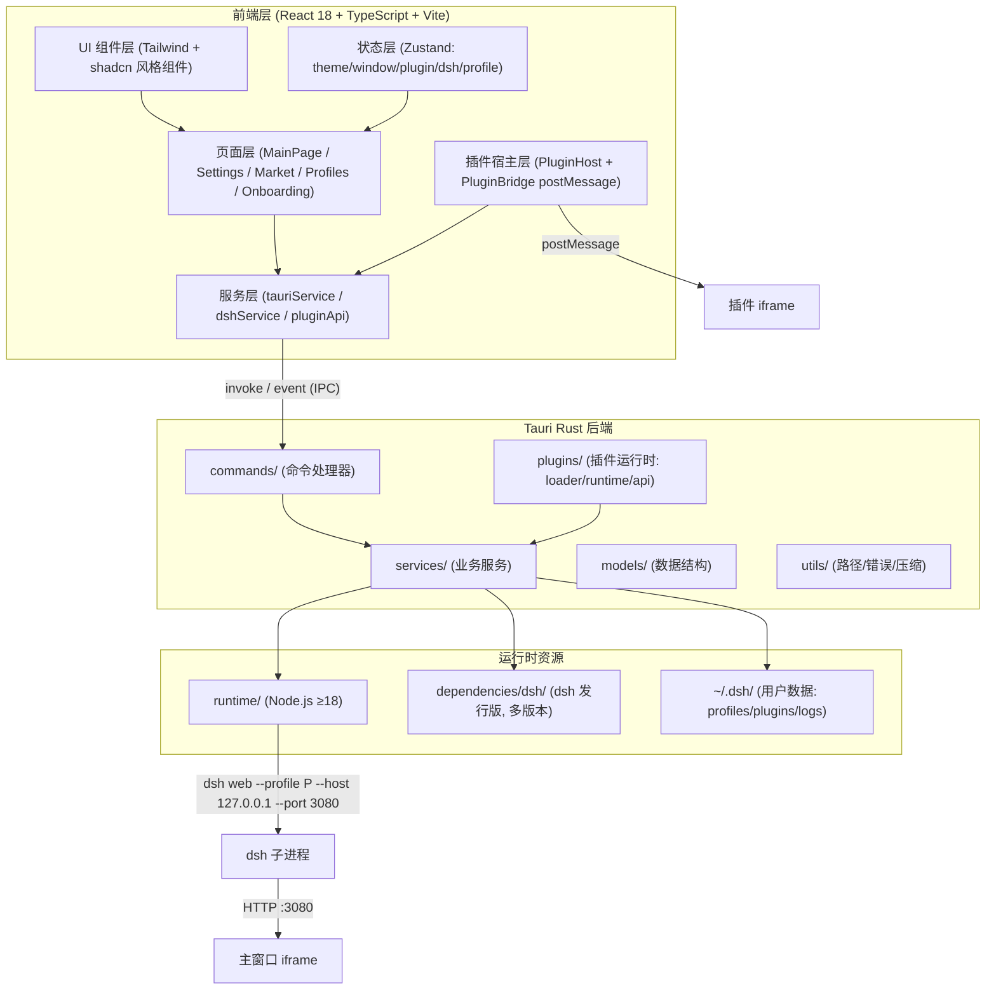
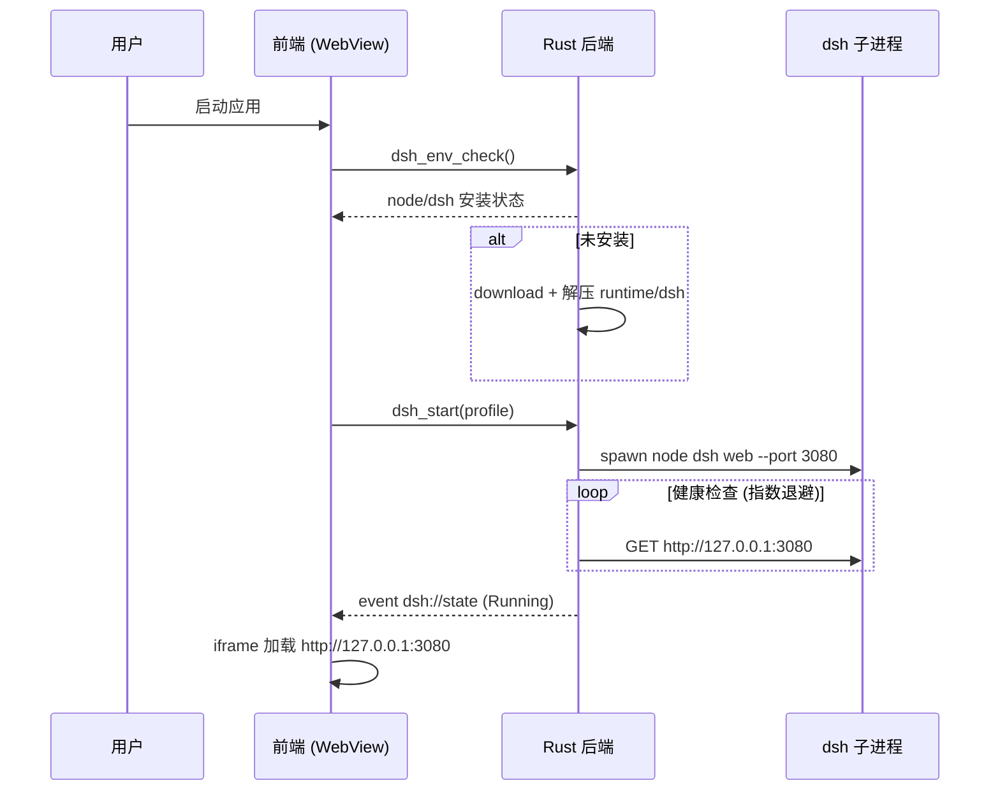
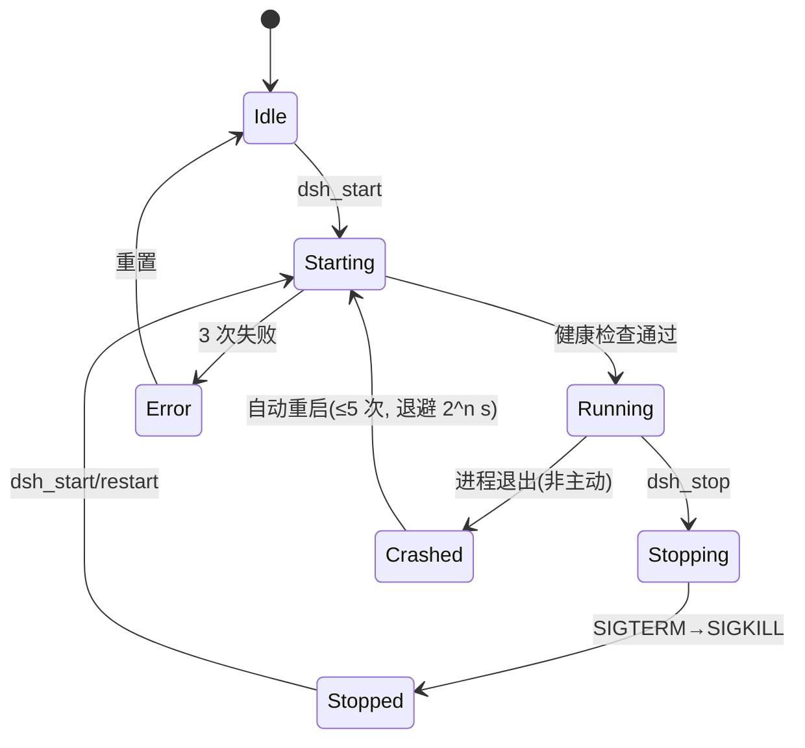
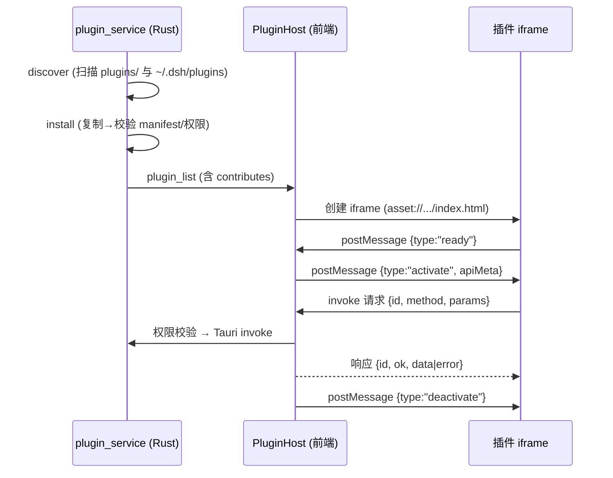

# dsh-tauri-desktop 系统架构文档

> dsh（DeepSeek Harness）的 Tauri 2 原生桌面壳。独立实现，与 dsh 核心通过子进程 + HTTP(iframe) 集成。

## 1. 总体架构



**数据流（启动到可用）：**



## 2. 模块划分与职责

| 模块 | 层 | 职责 | 关键接口 |
|---|---|---|---|
| 窗口与外壳 | 前端+Rust | 自定义标题栏、多窗口、状态持久化、托盘、闪屏 | `window_minimize/maximize/close`, TrayIconBuilder |
| workflow_service | Rust | dsh 子进程生命周期、健康检查、崩溃恢复、日志转发 | `dsh_start/stop/restart/status` |
| core_service | Rust | dsh 核心多版本检测/安装/切换 | `core_list_versions/installed/install/use` |
| profile_service | Rust | 档案 CRUD、切换、导入导出 | `profile_list/create/delete/export/import` |
| plugin_service | Rust | 插件发现/安装/卸载/启用、存储隔离 | `plugin_list/install/uninstall/enable` |
| plugin runtime | Rust+前端 | manifest 校验、iframe 宿主、postMessage 桥 | `plugin_asset`, bridge protocol |
| download_service | Rust | 断点续传下载、zip/tar.gz 解压、进度事件 | `download_file/cancel` |
| market_service | Rust | 官方注册表（远程+内置回退）、GitHub 搜索、zipball 安装/升级 | `market_official/search/install/upgrades` |
| update_service | Rust | GitHub Releases 检查/下载/SHA256 校验/应用 | `update_check/download_and_apply` |
| cli_service | Rust | PATH shim 注册（跨平台） | `cli_install_shim/cli_status` |
| notification | Rust | 跨平台系统通知 | `notify` |

## 3. 接口定义（Tauri 命令一览）

| 命令 | 参数 | 返回 | 事件 |
|---|---|---|---|
| `dsh_env_check` | – | `EnvCheckResult` | – |
| `dsh_start` | `{profile?,host?,port?}` | `DshStatus` | `dsh://log`, `dsh://state` |
| `dsh_stop` / `dsh_restart` / `dsh_status` | – | `DshStatus` | – |
| `core_list_versions` / `core_current` | – | `Vec<CoreVersion>` / `String` | – |
| `core_install` | `{version}` | `()` | `download://progress` |
| `core_use` / `core_remove` | `{version}` | `()` | – |
| `profile_list` | – | `Vec<Profile>` | – |
| `profile_create/delete/switch` | `{name}` | `()` | – |
| `profile_export` | `{name,dest}` | `()` | – |
| `profile_import` | `{src}` | `Profile` | – |
| `plugin_list` | – | `Vec<PluginInfo>` | – |
| `plugin_install` | `{path}` | `PluginInfo` | – |
| `plugin_uninstall/enable` | `{id,enabled?}` | `()` | – |
| `plugin_readme` / `plugin_manifest` | `{id}` | `String` / `Manifest` | – |
| `plugin_storage_get/set/delete` | `{pluginId,key,value?}` | `string?` | – |
| `plugin_asset` | `{id,path}` | `Asset{mime,content?}` | – |
| `download_file` | `{url,dest?}` | `{id}` | `download://progress` |
| `download_cancel` | `{id}` | `()` | – |
| `market_official` | – | `MarketRegistry` | – |
| `market_search` | `{query}` | `Vec<MarketRepo>` | – |
| `market_install` | `{repo,subpath?}` | `PluginInfo` | `download://progress` |
| `market_upgrades` | – | `Vec<MarketPlugin>` | – |
| `cli_install_shim` / `cli_status` | – | `CliStatus` | – |
| `update_check` | – | `UpdateInfo?` | – |
| `update_download_and_apply` | – | `()` | `update://progress` |
| `notify` | `{title,body}` | `()` | – |
| `settings_get` / `settings_save` | `AppSettings` | – | – |
| `presets_get` | – | `PresetsFile`（资源可远程替换） | – |
| `window_*` (minimize/maximize/close/isMaximized) | – | – | – |

### 3.1 后端事件一览（前端 `listen` 订阅）

| 事件 | 负载 | 触发时机 |
|---|---|---|
| `dsh://log` | `LogLine { level, line, ts }` | dsh 子进程 stdout/stderr 逐行转发（同时落盘） |
| `dsh://state` | `DshStatus` | dsh 状态迁移（启动/就绪/停止/崩溃/错误） |
| `download://progress` | `DownloadProgress` | 下载任务每 200ms 节流推进（含失败/取消终态） |
| `update://progress` | `UpdateProgress` | 自更新下载/校验/应用阶段推进 |
| `core://outdated` | `{ current, latest }` | 启动时对比本地 CURRENT 与远端最新发行版，仅过期时触发；GitHub 不可达静默 |

## 4. 数据模型（核心结构）

```rust
// models/profile.rs
pub struct Profile { id, name, dsh_home: PathBuf, default_port: u16, created_at, extra: JsonMap }

// models/plugin.rs
pub struct Manifest { name, id, version, description, author, entry, permissions: Vec<Permission>, contributes: Contributions }
pub enum Permission { Fs, Exec, Storage, Git, Network, Ui, Notification }
pub struct Contributions { sidebar: Vec<SidebarEntry>, panel: Vec<PanelEntry>, command: Vec<CommandEntry>, setting: Vec<SettingEntry>, theme: Option<ThemeContribution> }
pub struct PluginInfo { manifest, dir, enabled, builtin, error: Option<String> }

// services/workflow_service.rs
pub enum DshState { Idle, Starting, Running, Stopping, Stopped, Crashed, Error }
pub struct DshStatus { state, pid: Option<u32>, port, profile: Option<String>, restarts: u32 }
```

## 5. 状态流转

**dsh 进程状态机：**



**插件生命周期：**



## 6. postMessage 协议规范（PluginBridge）

传输：`window.postMessage(msg, "*")`；主进程侧监听并校验 `source` 所属 iframe。

**通用信封：**

```ts
interface BridgeMessage {
  id: string;            // 请求 id（响应回传同 id）；事件类消息为 "evt:<uuid>"
  pluginId: string;
  type: "req" | "res" | "evt";
  method?: BridgeMethod; // req 专用
  payload?: unknown;     // req: 参数 / res: data|error
  ok?: boolean;
  error?: string;
}
type BridgeMethod =
  | "fs.read" | "fs.write"                  // 白名单路径
  | "exec.run"                              // 允许列表命令
  | "storage.get" | "storage.set" | "storage.delete"
  | "git.run"                               // 基本封装
  | "http.request"                          // 经后端代理
  | "ui.registerSidebar" | "ui.registerPanel" | "ui.showNotification" | "ui.registerContextMenu"
  | "tauri.invoke" | "tauri.listen";
```

约定：请求方生成 `id`（`crypto.randomUUID`），宿主按 id 关联回响应；`evt` 用于宿主→插件广播（主题变化、dsh 状态变化、面板间消息 `panel.message`）。

## 7. 插件 manifest 规范（摘要）

```jsonc
{
  "id": "com.example.my-plugin",        // 反向域名，全局唯一
  "name": "My Plugin",
  "version": "0.1.0",                   // semver
  "description": "...",
  "author": "someone",
  "entry": "index.html",                // 相对插件根目录
  "permissions": ["ui", "storage"],
  "contributes": {
    "sidebar": [{ "id": "main", "title": "MyPlugin", "icon": "puzzle" }],
    "panel":   [{ "id": "view", "title": "View" }],
    "command": [{ "id": "do-it", "title": "Do It" }],
    "setting": [{ "key": "limit", "type": "number", "default": 10 }],
    "theme":   { "cssVariables": { "--accent": "#4f8cff" } }
  }
}
```

完整字段、权限语义与示例见 `docs/PLUGIN_API.md`。

## 8. 目录布局（运行时）

```
~/.dsh/
├── bin/dsh(.cmd)          # CLI shim
├── profiles/<name>/       # 档案隔离目录（含 profile.json）
├── plugins/<id>/          # 用户安装插件
├── storage/<pluginId>.json# 插件 KV 存储
├── logs/dsh-*.log         # dsh 子进程日志
└── settings.json          # 应用设置（与窗口状态分离）
<app_dir>/
├── runtime/node-vX/       # 内置 Node 运行时
└── dependencies/dsh/<ver> # dsh 核心多版本
```

## 9. 安全模型

- 插件 fs/exec 走白名单（fs 白名单默认 `~/.dsh/**` + 档案目录；exec 默认仅 `git/node/pnpm/npm`，可由用户在设置中扩展）。
- 插件网络一律经 Rust 端 `http.request` 代理，禁止插件 iframe 直连外网。
- 更新包 SHA256 校验（来自 `latest.json` 元数据），失败即丢弃。
- 敏感配置存于 `~/.dsh/settings.json`（用户目录，非 WebView localStorage），不随 iframe 暴露。
- dsh 子进程以当前用户权限运行，不提权。

## 10. 平台差异处理

| 能力 | Windows | macOS | Linux |
|---|---|---|---|
| 标题栏 | 右侧控制按钮（decorations:false） | 交通灯区左留白（titleBarStyle overlay） | 右侧控制按钮 |
| CLI shim | `~/.dsh/bin/dsh.cmd` + 用户 PATH 注册表 | `~/.local/bin/dsh` + .zshrc/.bashrc | 同 macOS |
| 通知 | tauri-plugin-notification(WinRT Toast) | NSUserNotification/MacUI | notify-rust (dbus/notify-send) |
| 打包 | NSIS | DMG (aarch64+x86_64) | AppImage + deb |
